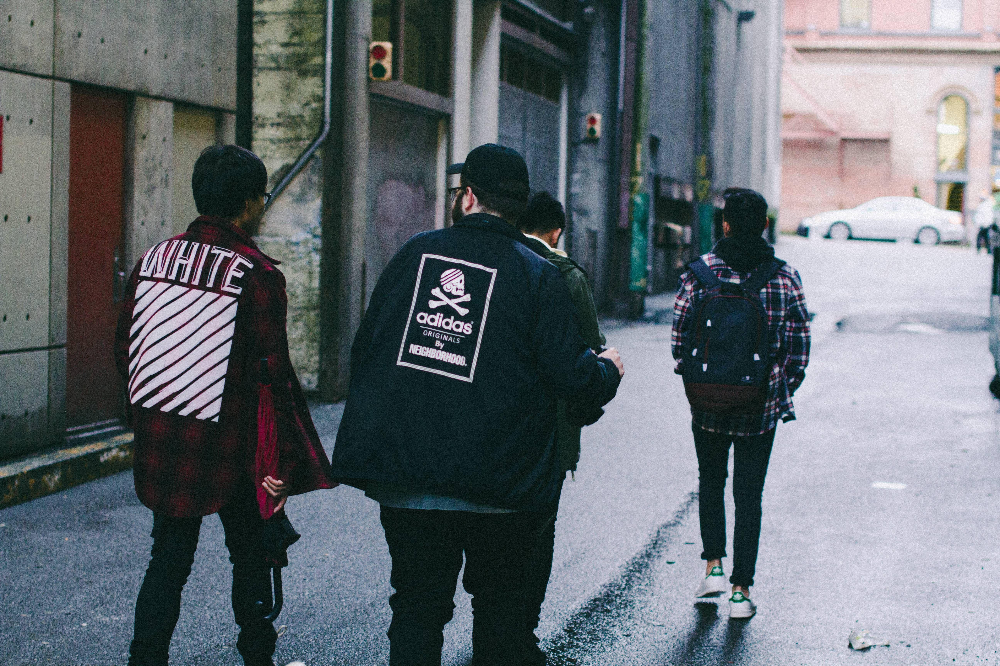

## LaClothes the perfection can now fit for you 🌟

Laclothes is a fictional clothing store that I've built and my objective is make you feel in a real store when you can register, use the cart for store your clothes, simule the buying, and more! 

